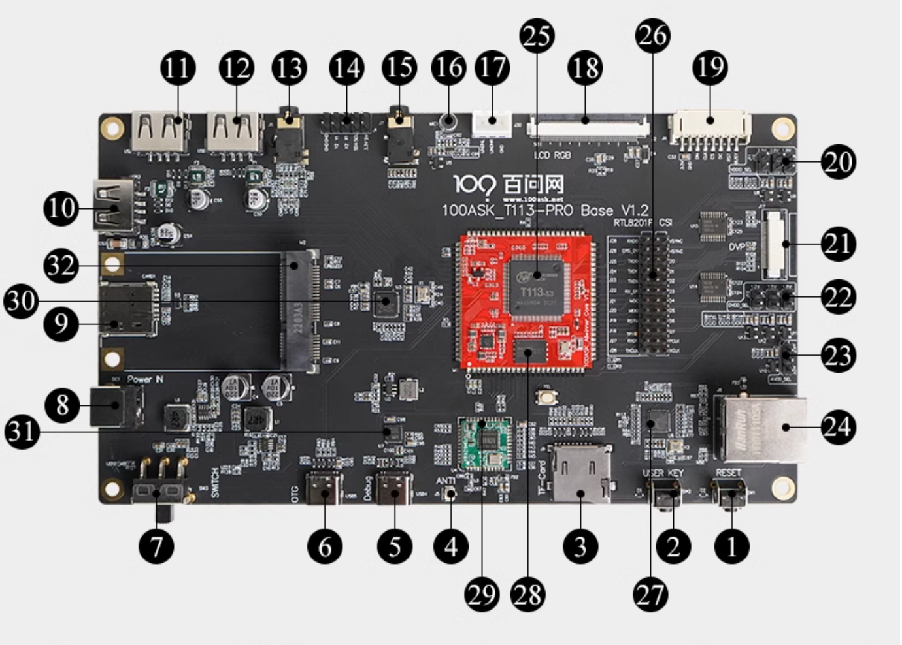

# T113s3 Tina4SDK

## 开发板资源

《嵌入式Linux开发：一板懂，百板通》系列课程 之T113版本，快速了解嵌入式Linux开发框架流程，使用全志原厂SDK+配套手册实现自己的毕业设计、项目、应用！

- 资料汇总页面：http://wiki.100ask.net/100ASK_T113s3-PRO
- 视频教程地址 : [https://www.bilibili.com/video/BV1Nx4y1w7AF/?spm_id_from=333.999.0.0](https://gitee.com/link?target=https%3A%2F%2Fwww.bilibili.com%2Fvideo%2FBV1Nx4y1w7AF%2F%3Fspm_id_from%3D333.999.0.0)
- 学习交流技术社区： [https://forums.100ask.net/c/aw/t113s3/19](https://gitee.com/link?target=https%3A%2F%2Fforums.100ask.net%2Fc%2Faw%2Ft113s3%2F19)
- 程视频文件以及配套资料网盘地址：链接：[https://pan.baidu.com/s/1Nz9JCFXCr3Ip3Ig8k-SUoQ?pwd=98d5](https://gitee.com/link?target=https%3A%2F%2Fpan.baidu.com%2Fs%2F1Nz9JCFXCr3Ip3Ig8k-SUoQ%3Fpwd%3D98d5)



## 环境搭建

### 获取SDK源码

1. 获取Tina-sdk源码 百度网盘获取地址 链接：https://pan.baidu.com/s/13uKlqDXImmMl9cgKc41tZg?pwd=qcw7 提取码：qcw7 压缩包路径在 Tina-SDK_DevelopLearningKits-V1/DongshanNezhaSTU-TinaV2.0-SDK  拷贝进Ubuntu系统内，并进行解压缩,解压命令在README里面

### 配置ubuntu环境

配置开发环境，这里以ubuntu-18举例

> sudo apt-get install build-essential subversion git libncurses5-dev zlib1g-dev gawk flex quilt libssl-dev xsltproc libxml-parser-perl mercurial bzr ecj cvs unzip lib32z1 lib32z1-dev lib32stdc++6 libstdc++6 libc6:i386 libstdc++6:i386 lib32ncurses5 lib32z1 -y

### 获取补丁包

获取扩展支持仓库，然后加以应用

```shell
book@ubuntu1804:~$ git clone https://github.com/DongshanPI/100ASK_T113-Pro_TinaSDK.git
book@ubuntu1804:~$ cd 100ASK_T113-Pro_TinaSDK
book@ubuntu1804:~/100ASK_T113-Pro_TinaSDK$ git submodule update --init
book@ubuntu1804:~/100ASK_T113-Pro_TinaSDK$ cp ./* -rfvd ~/tina-d1-h
```

### 配置单板编译

应用完成，可以进入之前解压缩过的 tina-d1-h sdk目录内，执行如下命令来开始编译T113 tinasdk

```shell
book@ubuntu1804:~/tina-d1-h$ source build/envsetup.sh
Setup env done! Please run lunch next.
book@ubuntu1804:~/tina-d1-h$ lunch

You're building on Linux

Lunch menu... pick a combo:
     1. d1-h_nezha_min-tina
     2. d1-h_nezha-tina
     3. d1s_nezha-tina
     4. t113_nezha-tina

Which would you like?: 4
============================================
TINA_BUILD_TOP=/home/book/tina-d1-h
TINA_TARGET_ARCH=arm
TARGET_PRODUCT=t113_nezha
TARGET_PLATFORM=t113
TARGET_BOARD=t113-nezha
TARGET_PLAN=nezha
TARGET_BUILD_VARIANT=tina
TARGET_BUILD_TYPE=release
TARGET_KERNEL_VERSION=5.4
TARGET_UBOOT=u-boot-2018
TARGET_CHIP=sun8iw20p1
============================================
no buildserver to clean
[1] 35382
book@ubuntu1804:~/tina-d1-h$ make
```

### 镜像烧写

视频文档站点： https://gitee.com/weidongshan/eLinuxDevGeneralCourse

文档资料： https://gitee.com/weidongshan/eLinuxDevGeneralCourse/blob/master/100ASK_T113_PRO/Section2/02-100ASK_T113-Pro%E5%BC%80%E5%8F%91%E6%9D%BF%E4%B8%8A%E6%89%8B%E4%BD%93%E9%AA%8C.md


## T113芯片架构

